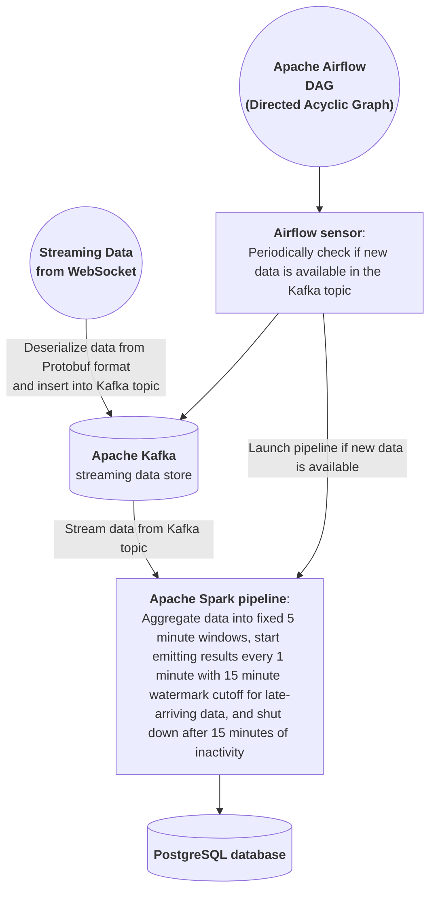

## Data Engineering Workflow

## Challenges
- Performing an "upsert" to PostgreSQL (INSERT INTO ... ON CONFLICT DO UPDATE) from Spark is not directly possible, but because I wanted to begin emitting results early for the average price in each 5-minute time window (so that aggregated data would still be available in near real-time), it was required that database rows could be written then updated as necessary. The workaround I used was writing the update rows to a staging table in Postgres, then executing a SQL query with psycopg2 to "upsert" into the target table from the staging table. Then the staging table is dropped.
- To enable stopping the pipeline during long idle periods when no data is flowing in and re-starting when data ingestion resumes, I needed to keep track of Kafka high watermark offsets. To do this within Spark is challenging because Spark Streaming manages its own offset tracking and does not commit them to Kafka due to its at-least-once processing guarantee, which for some reason isn't compatible with committing offsets to Kafka. And while Spark does seem to recover perfectly from unexpected failures, and creates checkpointing files which track its offsets, I was having trouble with verifying that these were always accurate (such as when a database write fails, if the offsets pertaining to that database write were already logged). So my solution was to keep track of offsets separately, up to the point whenever the query batchID increments (because that seems to always occur after the foreachBatch database write successfully happens), and write them to a file. That solution seems to yield accurate results when querying with the Airflow sensor to determine how many unread events are in Kafka.
- I initially wanted to write the data pipeline with Apache Beam, but I was never successful in getting it to work correctly. It works perfectly running in batch-mode (such as querying a limited-size batch from the Kafka topic), but in streaming mode it only yields errors. There seems to be some incompatibility, probably with using a Direct Runner as I was attempting. If I ever get back to it, I suspect that using the Spark Runner, Flink Runner, or Dataflow Runner will work since those seem to have significantly more development effort behind them. But I decided instead that the best solution for my use case was just to write the pipeline to run directly in Spark.
	- I ended up contributing a PR to the Airflow providers repository for the BeamRunPythonPipelineOperator because there was a bug that wouldn't allow it to run pipelines from files stored locally.

## Future Plans
- Add additional data collection, such as news articles collected with web scraping, and perform feature transformation methods to store (such as sentiment scores for news articles). And maybe weather data.
- Develop a time-series neural network model that is trained on past data, and conditioned on other various factors. 

